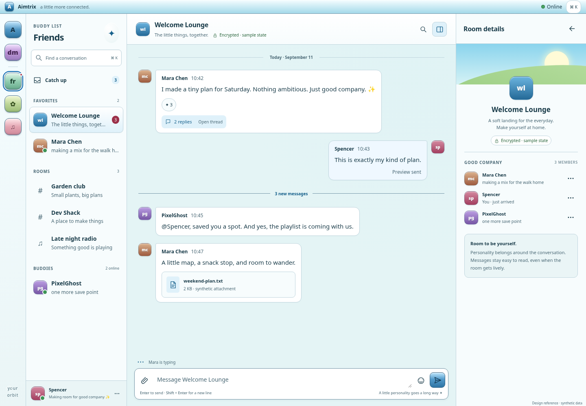

# Aqua/Aero references and interaction rules

Design decisions for [#142](https://github.com/spencerrung/aimtrix/issues/142) · September 11, 2026. Implements the design deliverable in the [polish roadmap](../polish-plan.md); the [capability baseline](../capability-baseline.md) remains the record of shipped behavior and validation.

Open [the interactive reference](references.html) to compare conversation, thread, empty, and failure layouts. Its controls operate on synthetic, local demonstration state. It is a design artifact outside the deployable application, with no Matrix session or real sending, retry, recovery, search, or member-management operation. Future implementation must connect each interaction to its owning view model and protocol action before exposing it in the client.

From the repository root, serve the reference locally:

```sh
python3 -m http.server 4180 --bind 127.0.0.1 --directory docs/design
```

Open [http://127.0.0.1:4180/references.html](http://127.0.0.1:4180/references.html). Theme, Scene, Frame, and Reading style select the comparison. Add `?presentation=1` to hide the review toolbar and let the reference occupy the whole viewport; this is the mode used for exact viewport screenshots. The framed review bench itself is not proposed application chrome.

With the repository's npm dependencies and Playwright Chromium installed, run the repeatable reference checks separately:

```sh
node docs/design/verify.mjs
```

The verifier starts and stops its own local HTTP server, writes screenshots to `/tmp/aimtrix-step02-ui` on this Linux workspace, and is configured for 28 layout checks, 19 Axe scans, and local interaction journeys. These are expected counts, not a pass claim; actual results belong in the dated validation record below. An optional first argument selects a different artifact directory. This reference check does not replace the application's required gates.

## Decisions

Aimtrix serves the shared daily needs of friends, communities, and work teams first. Conversation text, the active room, unread boundaries, and action outcomes have the strongest hierarchy. The space rail, buddy list, glossy chrome, candy accents, room atmosphere, and personality drawer remain recognizable. The accepted roughly 65/35 Aqua-era character versus modern behavior is a direction for the whole experience, not a quota of decorated pixels.

Content-sized bubbles remain the default, including opposite alignment for the current user's messages. Existing density, message-scale, message-surface, accent, theme, motion, and drawer preferences survive implementation. The reference's optional aligned room presentation is a comparison preset; adopting it must be an explicit preference, with the existing presentation preserved during migration. Do not replace bubbles with full-width rows as part of a shell refactor.

At desktop widths, thread, search, and buddy/room details occupy one contextual panel. Opening one replaces the visible content of that panel. A hidden panel retains its useful state without competing for space or accepting keyboard focus. Multi-panel layouts are deferred; they are not the default even on very wide monitors.

On smaller screens, list, conversation, and contextual content become deliberate routes. Back returns to the invoking conversation and its reading position. The composer remains reachable when usable height shrinks. Navigation survives through the route header when the space rail is hidden.

## Reference and implementation boundaries

| Item | Design decision | Implementation owner |
| --- | --- | --- |
| Visual hierarchy, surfaces, busy/empty/failure examples | Reviewable in the standalone reference | This issue, then the relevant slice |
| Shared modal/menu focus behavior and feedback | Contract below; local reference interactions are illustrative | [#144](https://github.com/spencerrung/aimtrix/issues/144) |
| One contextual panel, responsive routes, useful drawer, height handling | Shell contract below | [#148](https://github.com/spencerrung/aimtrix/issues/148) |
| Bubbles, grouped sender metadata, common rendering and actions | Preserve accepted appearance while sharing renderer behavior | [#152](https://github.com/spencerrung/aimtrix/issues/152) |
| Room/thread composer parity and draft preservation | Shared composition contract below | [#153](https://github.com/spencerrung/aimtrix/issues/153) |
| Browser, keyboard, contrast, accessibility, real keyboard evidence | Matrix and checklist below | [#162](https://github.com/spencerrung/aimtrix/issues/162) |

Delivery state, history navigation, and active-session recovery remain owned by [#145](https://github.com/spencerrung/aimtrix/issues/145), [#146](https://github.com/spencerrung/aimtrix/issues/146), and [#147](https://github.com/spencerrung/aimtrix/issues/147). Visual examples do not close those behavior or interoperability issues. Attachment staging belongs to [#154](https://github.com/spencerrung/aimtrix/issues/154).

The reference exposes all three themes and the two reading arrangements; it does not implement preference persistence or selectors for every production accent, density, text scale, or message surface. Its Back buttons change local visible surfaces; browser/OS route history, deep links, native Back, safe-area behavior, and physical software keyboards remain production acceptance requirements. Room choices deliberately share synthetic messages and an in-memory composer. Thread text survives local panel replacement, but drafts are not account-scoped or durable, and search/query/scroll restoration is not fully implemented. Message-tool dialogs preview emoji/code insertion and a room attachment sample; they do not supply full room/thread tool parity, real catalogs, upload encryption, or moderation. Preserve existing production features when applying this direction.

## Layout contract

All dimensions below are CSS pixels at default zoom. The reference uses its frame's container width/height; in presentation mode these equal the viewport. Use flexible tracks, `min-width: 0`, and independently scrolling lists/timelines. The page itself must not acquire horizontal scrolling. Browser zoom follows the effective CSS viewport and therefore moves into narrower routes when needed.

| Viewport | Required composition | Space priority |
| --- | --- | --- |
| 1440 × 1000 desktop reference | 64px space rail, 248px buddy navigation, flexible conversation, optional 320px contextual panel | Conversation receives remaining width; short messages remain content-sized |
| 1280 × 800 desktop minimum check | Same composition, one 320px contextual panel at most | No second details drawer behind a thread; keep composer controls inside their track |
| 1200px and wider | Docked contextual panel is allowed | Default panel follows saved drawer preference; opening thread/search replaces details |
| 1024 × 768 tablet check; 768–1199px wide | 64px rail and 232px navigation remain useful; contextual content replaces the conversation surface | Hidden conversation controls leave focus order; navigation remains accessible. Never place a narrow panel over an active composer |
| 412 × 915 mobile reference; below 768px | Buddy list → conversation → thread/details/search, one primary surface at a time; 64px lower rail | Header contains named Back action and room/thread identity; conversation exposes search/details, composer exposes More |
| 412 × 360 and 568 × 320 reduced-height checks | Compact conversation or thread chrome and reachable input/Send | At height ≤480px and width <1200px, hide the rail outside the list route; retain Back and More |

The desktop reference has a 34px app title bar and 74px conversation/panel headers. Mobile uses a 32px title bar, 68px conversation header, and 64px panel header. Reduced-height layouts use a 24px title bar and 48px conversation/panel headers. This reduction follows measured space even before the input is focused; it does not detect whether a keyboard is physically present. The verifier also checks 1024 × 360 tablet height reduction and a 320 × 568 narrow phone.

Use the reference stylesheet as the source for initial visual measurements. Production resizing may enlarge or shrink navigation/panel tracks within bounds only while leaving at least 420px for the main conversation; otherwise transition to the contextual route. This minimum governs an optional desktop split, not narrow-phone routes. The reference does not expose resize handles. Never respond to a new functional button by hiding an unrelated positional child. Use named groups such as primary actions and secondary tools.

The desktop default remains compatible with `detailsOpenByDefault: true`. A stored false value stays false. Opening a mobile conversation does not automatically navigate into details because the desktop drawer preference is true. Resizing between layouts retains the selected room/thread and draft; it must not push a duplicate navigation entry or mark a hidden room read.

### Panel and route transitions

1. Open a thread from its summary or message action. Preserve the room's scroll anchor and draft; replace the visible details/search panel with the thread. Focus its heading or primary control without opening the software keyboard automatically.
2. Open details or search while a thread is visible. Keep the thread draft and anchor; show only the requested panel. Do not send, clear, or discard composition during this transition.
3. Close a desktop panel. Return focus to its opener if it still exists, otherwise the room heading. Reopening that panel restores its tab, query, or thread context. Do not immediately reopen a different drawer on close.
4. On mobile, Back from thread/details/search returns to the same conversation. Back from conversation returns to the prior buddy list and selected scope. Browser/OS Back and the visible Back control follow the same route history.
5. Opening a message menu or picker adds temporary interaction state, not another room-navigation entry. Escape dismisses the topmost temporary surface before closing its containing route.

Do not move a detached reader to the latest message because a drawer closes, media loads, or another message arrives. A visible “Jump to latest” action handles that change deliberately. Loading an old thread root or search result must preserve its actual event context; a design preview cannot establish this history behavior.

### Buddy list and personality drawer

The buddy list communicates scope, readable room/buddy names, latest context, selection, and unread information. A selected row uses a filled accent surface and a non-color cue. An unread row uses emphasis and an accessible unread label; mention counts distinguish mentions from general activity. Unknown presence is labeled unknown/offline according to available data, never invented as online. Long names truncate visually with an accessible full name.

The drawer remains a useful Buddy Card or Room Lounge: identity and available presence, room purpose, People, Moments, About, Backdrop, and permission-gated Manage. Keep the profile atmosphere and original art, with less competition around member text. Put role changes, kick/ban, and other administration in an explicit member action menu or Manage flow. Everyday member rows show identity and meaningful status without permanent role selects.

Private profile decorations and private DM backdrops are identified as private to their existing audience. Shared room/space backdrop settings explain their actual audience and permission requirements. The design does not make private account data public. No generic “verified” or “secure” decoration may substitute for device/room security state.

## Visual system

The reference's [stylesheet](reference.css) contains the proposed swatches and layout samples. Adapt these into the application's existing semantic token system in [styles.css](../../src/styles.css), rather than layering unrelated component-specific palettes over it. Existing theme names remain Aqua, Graphite, and Midnight; existing accent choices remain blue, grape, rose, tangerine, and lime.

Core swatches used by the reference:

| Reference role | Aqua | Graphite | Midnight |
| --- | --- | --- | --- |
| Reading surface / raised surface | `#f7fcfd` / `#ffffff` | `#f5f6f7` / `#ffffff` | `#1b2d39` / `#243b49` |
| Body / muted text | `#193b49` / `#4b6976` | `#293944` / `#52626e` | `#eef7fc` / `#b4cbd7` |
| Accent / soft accent | `#17618c` / `#dff1fa` | `#3e5c73` / `#e6edf3` | `#9bdcff` / `#294b63` |
| Chrome gradient | `#f5fdff` → `#a3d9e9` | `#f8f9fa` → `#c1cbd2` | `#354f61` → `#1d3242` |
| Focus | `#005faa` | `#244c6d` | `#b3e3ff` |

| Token role | Application mapping | Rule |
| --- | --- | --- |
| Main reading surface | `--surface`, `--surface-raised` | Stable contrast beneath message text; no animated artwork directly competing with text |
| Recessed and grouped surfaces | `--surface-soft`, `--surface-inset` | Subtle hierarchy for lists, root previews, and controls |
| Gloss and chrome | `--chrome-start`, `--chrome-end`, `--chrome-highlight` | One light edge and restrained gradient on structural chrome and primary controls |
| Borders | `--border`, `--border-soft`, `--border-strong` | 1px separators; stronger control/focus boundaries where needed |
| Body and metadata | `--text`, `--text-soft`, `--text-faint` | Metadata is readable text, not low-contrast decoration; resolve all pairs against rendered backgrounds |
| Accent and selection | `--blue`, `--blue-deep`, `--blue-soft`, `--selection-*` | Accent communicates interaction/selection; theme-aware foregrounds must survive all five accent choices |
| Keyboard focus | `--focus` | Solid 3px visible outline, 2px offset; remains visible on gloss and dark surfaces |
| Presence and feedback | `--online`, `--away`, `--busy`, `--offline`; dedicated feedback roles when extracted | Text/icon accompanies color; distinguish error from busy presence by wording and placement |
| Atmosphere | `--wallpaper`, `--wallpaper-deep`, `--pinstripe` | Sky/water/green accents and restrained original bubbles; avoid repetitive decorations inside message content |

Use a 4px spacing rhythm as the production target: 4 for small related details, 8 for inline groups, 12 for compact card padding, 16 for panel sections, 24 for major separation, and 32 for empty-state breathing room. The reference also uses local optical adjustments, including 10px message gaps and 18px message separation. Preserve message-density choices: compact reduces message and navigation spacing; comfortable is the comparison baseline; roomy adds separation. Density must not shrink touch targets.

Reference typography uses the existing Lucida-style stack with system sans-serif fallback. Actual core sizes are 15px/1.65 conversation text on desktop, 14px/1.65 on mobile, 13px thread text on desktop and 14px on mobile, 12px message timestamps, 14px list names with 12px desktop/11px mobile secondary text, 16px room/panel headings, and 24px empty-state headings. Sender metadata is 12px on desktop and 11px on mobile; timestamps remain 12px. Main/thread input text is 14px/13px on desktop and 16px for both on mobile. Some secondary chrome, helper copy, badges, and reference-only labels use smaller 9–11px sizes; these are not a blanket production typography rule.

For production extraction, target 14px general chrome/list text, 15px default body text, 12px metadata/helper text, 16px panel headings, and 24px empty-state headings, with line height suited to reading length. Map existing small/medium/large message preferences deliberately; never reset a saved large size to match a screenshot. Form inputs on touch layouts use at least 16px. Use semibold names and selected room titles; avoid bolding every label.

The reference uses 8px general control radii, 12px composer radii, and asymmetric 13px message corners with one 4px corner to retain direction; grouped bubbles use 10px. Production tokens should preserve this bubble character while standardizing controls/cards around an 8/12/16px scale. Pill shapes belong to presence, reactions, and small status badges. Reference action SVGs are generally 19px with smaller local variants, and timeline avatars are 32px. Production targets are 16–20px action icons, 20–24px major navigation symbols, and 32–36px timeline avatars. Interactive hit areas remain at least 44 × 44px on touch layouts; dense desktop controls have at least 32 × 32px targets and sufficient separation. The reference's mobile Send, overflow, attachment, reaction, and thread-entry targets use 44px dimensions. Inline text links remain underlined and have readable surrounding spacing.

Reserve broad shadows for floating menus/dialogs; docked panels use a border. Avoid placing the old floating-window shadow around the whole full-viewport application. Message bubbles get at most a subtle edge/shadow. A stronger shadow should communicate elevation, not the importance of every control.

Normal text targets at least 4.5:1 contrast; large text at least 3:1; meaningful control boundaries and focus at least 3:1 against adjacent surfaces. Check actual rendered gradient, backdrop, selected, hovered, and disabled combinations. Sender-color hashes cannot bypass contrast checks: choose a legible theme-specific foreground or fall back to normal text. Frosted and clear message-surface preferences require a stable text backing; reduced transparency and forced colors receive solid readable fallbacks. The reference palette is not proof that every production surface or accent has passed.

Production motion is short and functional: 120ms hover/press transitions, at most 180ms panel/menu transitions, and no animation needed to understand state. The reference uses immediate surface changes and a 1px pressed-button translation; its reduced-motion rule removes transforms, animations, and transitions. Production reduced motion additionally disables nudges, ambient movement, and pulsing indicators. The user's existing motion, nudge, autoplay, and data-saver preferences remain authoritative. Do not animate incoming messages in a way that moves the reading anchor.

## Message and composer behavior

Keep a maximum text-bubble width of 680px and allow wrapping within its actual column. Short content stays narrow. Group visually consecutive messages from the same sender only when sender, room/thread context, day, and meaningful state boundaries remain understandable. Repeated sender metadata may be reduced; each message retains its accessible sender/time/action context. Unread dividers, thread roots, system events, and delivery errors break grouping when necessary for comprehension.

Expose message actions on hover and keyboard focus. Touch has an always-discoverable named overflow action; long press may be an additional gesture. Menus name their target message sufficiently for assistive technology without logging its body. Reply, thread, reaction, edit, copy, pin, and redaction appear only with supported event types and current permissions. Destructive actions have plain language and the required confirmation; unsupported events retain truthful fallback content.

Room and thread composers share the same basic layout and capability rules. Keep text input, Send, and a named More control reachable in every layout. Move Text/code-language tools, formatting, and optional media entry points into an organized More surface at narrow sizes. Emoji and stickers remain discoverable through that surface. An optional GIF/call capability remains hidden unless validated configuration and runtime support permit it.

The composer labels its destination: “Message [room]” or “Reply in thread.” Reply/edit context appears directly above the field with a named cancel action. At reduced height, summarize the context on one line with a way to inspect it; do not remove context from the outgoing event. Let multiline input scroll after a bounded height instead of consuming the entire timeline. Maintain safe-area padding and visible Send when the viewport contracts.

Use Enter to send and Shift+Enter for a newline in the desktop shared composer, subject to existing supported user settings. Never send while an IME composition is active. Touch keyboards must retain an intentional newline path and a visible Send action; verify their actual event behavior on devices before claiming support. Temporary menu interaction preserves the draft and selection; closing a picker returns focus sensibly without unintentionally dismissing an already-open keyboard.

Sending clears only the submitted draft version after its corresponding success. An older failed request must not overwrite text typed later. Draft storage, account isolation, reload restoration, logout cleanup, and storage failures are implementation requirements under #153; a reference field retaining text during local tab changes is not durable-draft evidence. Failed attachment items retain their individual retry/remove actions without blocking unrelated valid text where the chosen send contract allows it.

## Focus, menus, and feedback

Use actual buttons, labeled inputs, links, and form submission where their semantics apply. Tooltips supplement accessible names and never provide the only touch explanation. Mark pressed/expanded/selected states with the corresponding semantics. Menus use a consistent keyboard model: focus the first enabled item, Arrow keys move, Home/End reach boundaries, Escape closes and restores the opener. A popover containing a form uses form focus order rather than pretending its inputs are menu items. Tabs use arrow navigation with one active tab stop and a labeled associated panel.

Modal dialogs have a visible title and close/cancel action, meaningful initial focus, contained Tab/Shift+Tab, and an inert background. A destructive confirmation initially favors the safe action. Escape dismisses the topmost dismissible surface; a nested verification flow does not also close settings. Closing returns to the opener or a stable heading when the opener no longer exists. A docked desktop panel is a labeled region with normal page focus order, not a modal focus trap. Its mobile overlay/route must remove background controls from navigation and assistive technology.

Async actions show a local pending label, prevent duplicate submission, and retain useful form values on failure. Use a polite live region for completion and nonurgent progress, without announcing every upload percentage. Use an assertive announcement for new blocking errors when necessary; do not repeatedly announce persistent banners on sync updates. Success follows the resolved operation and refreshed server state, not the initial click. Clipboard success follows a successful clipboard write.

| Situation | Example wording | Required response |
| --- | --- | --- |
| Queued local event | “Waiting for connection” | Remains distinguishable from a rejected send |
| Encryption/send in progress | “Encrypting…” / “Sending…” | Use the actual event phase; do not collapse a failed event into pending |
| Rejected send | “Message was not sent.” | Inline Retry and remove/cancel action; preserve newer composition; map rate limits or permission reasons when known |
| Connection loss | “Offline. Messages may be delayed.” | Nonmodal banner; reconnect state updates without implying successful delivery |
| Expired session | “Your session expired. Sign in to continue.” | Reauthentication flow with truthful local-history/draft consequences; no silent plaintext fallback |
| Unable to decrypt | “This message cannot be decrypted on this device.” | Details/recovery action appropriate to the actual reason; do not imply content was deleted |
| Empty room | “Start the conversation.” | Explain destination/encryption truthfully and keep the composer available if sending is allowed |
| Empty thread | “No replies yet.” | Show its root and reachable reply field; distinguish from failed history retrieval |
| History/search retrieval failure | “Could not load replies.” / “Search could not finish.” | Local retry and coverage/context retained; do not present a false empty result |
| Permission failure | “You no longer have permission to change this room.” | Refresh permission/server state and preserve safe editable values |
| Draft persistence failure | “This draft could not be saved on this device.” | Keep in-memory text and give a truthful recover/copy path; do not show a saved indicator |

Playful copy belongs in quiet empty states, atmosphere, and self-expression. Security, destructive operations, permissions, and failures use precise language. Avoid raw exception dumps, homeserver tokens, recovery material, and room/profile contents in logs or evidence. More detailed diagnostics are explicitly opened and sanitized.

## Acceptance checklist

This checklist defines what each implementation slice must demonstrate; unchecked production obligations are not evidence that the reference failed or that the app already implements them. The dated record below identifies what was actually exercised for this design artifact.

### Reference review — #142

- [x] Inspect desktop conversation, desktop thread, and mobile conversation screenshots with busy, empty, and failure states; verify the intended hierarchy and compare an expressive DM with a busy room.
- [x] At 1440 × 1000 and 1280 × 800, opening a thread replaces details; there is one contextual surface and a reachable main composer.
- [x] At 1024 × 768, contextual content has a useful readable route/overlay; no duplicate focusable background composer.
- [x] At 412 × 915, exercise list → conversation → thread → Back → list; inspect restored context and reachable controls.
- [x] At 412 × 360 and 568 × 320, inspect compact conversation/thread, Back, More, input, and Send without page overflow. Record that resized/emulated viewports do not validate a physical software keyboard.
- [x] Inspect Aqua, Graphite, and Midnight plus busy-room and expressive-bubble comparison; record which preferences/states the reference actually exposes.
- [x] Exercise all visible reference controls and synthetic failure recovery; explicitly identify demonstration-only operations. Check keyboard focus, Escape, and reduced motion for its local interactions.

### Accessible interaction implementation — #144

- [ ] Verify initial focus, Tab/Shift+Tab containment, Escape, nested surfaces, and focus restoration in settings, room creation, profile/backdrop, media viewer, and verification flows.
- [ ] Verify menu and tab keyboard behavior, touch-accessible actions, pending/duplicate/error/success handling, destructive safe default, and disappearing-opener fallback.
- [ ] Verify live-region announcements with a screen reader, including a persistent connection error and a failed async action; Axe alone is insufficient.

### Shell implementation — #148

- [ ] Verify single-panel transitions and saved drawer-default compatibility; preserve room/thread scroll anchors, queries, and drafts when switching surfaces or resizing.
- [ ] Verify mobile visible Back and browser/OS Back, deep-linked event/thread entry, safe-area handling, and no unintended read marking on hidden surfaces.
- [ ] Verify all six viewport checks above, keyboard-height transitions while typing, deliberate rail hiding, and permanent reachability of required controls using semantic action groups.
- [ ] Verify the drawer's identity/presence/media/atmosphere functions and move role management behind permission-aware actions without removing functionality.

### Message and composer implementation — #152 / #153

- [ ] Preserve content-sized bubbles, own-message alignment, message-surface/density/scale settings, readable sender colors, long text/code/media constraints, and accessible message actions.
- [ ] Verify shared room/thread reply, edit, mention, emoji/sticker and optional media capabilities; no visible action bypasses unsupported-state or configuration checks.
- [ ] Verify IME Enter, multiline composition, selection after picker use, and newer-text preservation after an older send fails; validate actual SDK send/retry behavior under #145.
- [ ] Verify draft restoration after reload, storage denial, account switch, and logout; keep attachment byte persistence separate from structured text-draft guarantees.

### Continuing validation — #162

- [ ] Run the app's `npm run check` and `npm run test:e2e` gates for implementation changes, including meaningful regressions exposed by this work; report intentional skips separately.
- [ ] Inspect screenshots across themes, density/scale, reduced motion, forced colors, zoom/reflow, long content, empty/error states, and touch menus. Measure rendered contrast rather than inferring it from token names.
- [ ] Extend Chromium coverage to Firefox/WebKit and manual screen-reader/keyboard journeys; record browser, OS, revision, date, actual commands, and sanitized artifacts.
- [ ] Verify physical iOS/Android software keyboards, orientation changes, IME composition, viewport insets, and native Back behavior. Keep these unverified until actual devices are exercised.
- [ ] Keep live Matrix, encryption, push/provider, calls, and native-release acceptance in their owning roadmap issues. Synthetic references and mocked tests cannot establish those boundaries.

## Reference validation record

September 11, 2026 · Linux · Node 22.23.2 · Playwright Chromium 149.0.7827.55. This record covers the reference source delivered with this document, on top of capability-baseline commit `192207d`.

| Check | Actual result |
| --- | --- |
| `node docs/design/verify.mjs` | **28 layout checks passed; 19 Axe scans passed**, zero reported violations and zero browser exceptions |
| Local interaction journeys | Passed: one-panel replacement, room/thread draft retention, reply-count refresh, Tab/Shift+Tab-compatible dialog focus model and Escape restoration, quick switching, search jump focus, local emoji/code insertion, sample attachment staging/removal/send, reactions, empty/history samples, failed-send retry/edit without overwriting newer text, buddy cards, activity entry, mobile list/Back, frame/theme/reading/reset controls |
| `npm run check` | Passed: ESLint, **26 unit-test files / 209 tests**, TypeScript, production build and bundle budgets. Build took 2m 7s; expected large crypto-chunk warning and NAS output-directory timing warning remain |
| `npm run test:e2e` | **32 passed, 6 intentional skips**, 2.4m; desktop/mobile application suite against the local dev server |
| Final targeted validation | Reference verifier and ESLint repeated after the reference-only QA fixes; passed |
| Independent review | Fixed short-tablet grid collapse, unbounded desktop grid row, undersized touch controls, stale root reply count, and unnamed unread badges. Final review found no remaining structural/behavioral blocker; dialog close sizing and this evidence record completed afterward |

The reference matrix covers all three themes in desktop conversation, desktop thread, phone busy/failure/empty, and expressive DM scenes. Additional conversation/thread checks cover 1024 × 768, 1024 × 360, 412 × 360, 568 × 320, and 320 × 568. Screenshots were inspected for message hierarchy, long content and attachments, drawer replacement, composer reachability, and reduced-height navigation. The busy/failure snapshots scroll to the relevant content. Default bubbles and the aligned comparison are both exercised; existing production surface/density/accent/scale combinations are not claimed here.

Selected synthetic screenshots are versioned for review:

- [Desktop Aqua conversation](previews/desktop-aqua.png)
- [Desktop Midnight thread](previews/desktop-midnight-thread.png)
- [Mobile failed send](previews/mobile-failed-send.png)



The verifier regenerates the full screenshot set under `/tmp/aimtrix-step02-ui`; local logs are `/tmp/aimtrix-step02-reference-qa.log`, `/tmp/aimtrix-step02-check.log`, `/tmp/aimtrix-step02-e2e.log`, and `/tmp/aimtrix-step02-lint.log`. These logs contain synthetic/local test evidence, not production room data.

Axe scans establish only automatically detectable issues in the sampled Chromium states. Manual screenshot review does not establish every gradient/control contrast pair. Reduced motion uses a no-animation/no-transform stylesheet and a checked zero-transition state. Firefox, WebKit, forced colors, production preference combinations, screen-reader speech, physical keyboards/IME and safe-area behavior remain unverified. No live homeserver, SSO, encryption exchange, push provider, native shell, deployment, or infrastructure boundary was exercised by this design step.

No production Matrix feature is marked implemented by this document. Apply these decisions in the owning slices, update the capability baseline with actual evidence, and keep unresolved device and interoperability requirements visible.
