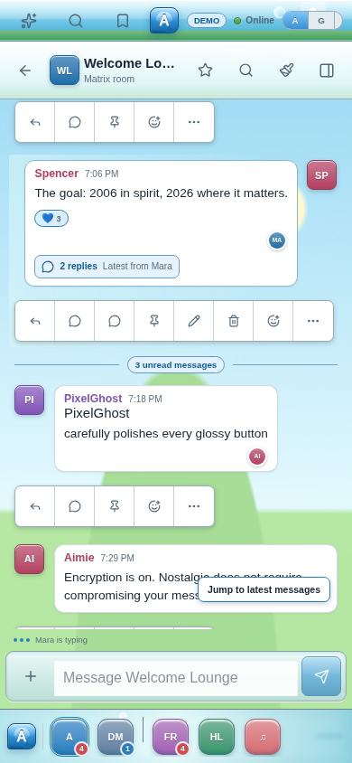
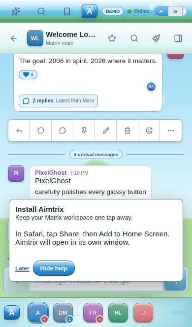
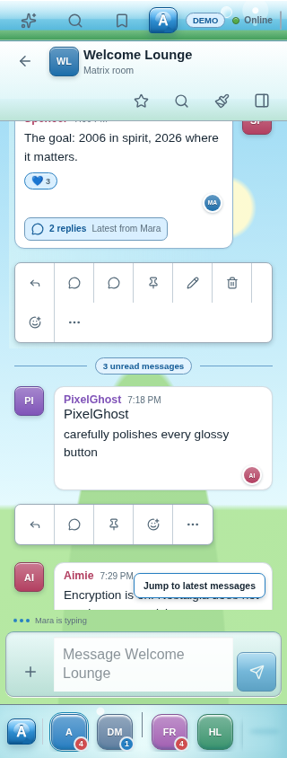
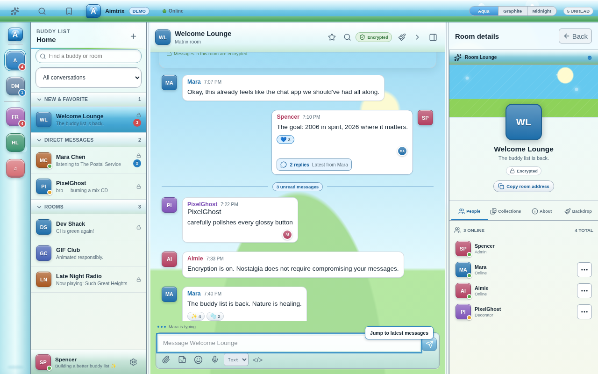

# Aimtrix daily usability and mobile validation audit

October 5, 2026 · Source baseline `145371b` · Research and browser audit

Aimtrix has substantial daily messaging functionality, but its presentation and acceptance tests still allow serious usability problems. The immediate priorities are mobile message density, unobstructed composition, viewport handling, clear navigation, and efficient desktop keyboard use. Preserve the accepted Aqua/Aero identity, bubbles, personality drawer, shared Matrix lifecycle, and encryption guarantees while improving those journeys.

This audit supplements [the polish roadmap](polish-plan.md), [interaction rules](design/interaction-rules.md), and [release inventory](../TODO.md). It does not reset completed protocol work or close existing release gates. Three independent reviews examined mobile/PWA behavior, desktop usability, and validation. The browser observations below use synthetic demo data. No production account or room was inspected.

## Current implementation map

| Area | Existing implementation and implication |
| --- | --- |
| Protocol and encryption | `src/matrix/` owns SDK lifecycle, immutable view models, encrypted sending, history, recovery, and media. UI work should continue consuming these actions. |
| Shell and navigation | `Workspace.tsx` composes the rail, list, conversation, contextual panel, and dialogs. `useShellNavigation.ts` already preserves room/thread reading positions and workspace-scoped history. Improve presentation without creating a second navigation state machine. |
| Composition | `SharedComposer.tsx`, `InlineComposer.tsx`, structured drafts, attachment staging, and `useWorkspaceDrafts.ts` already support room/thread composition. Changes must preserve selection, IME handling, async send safety, and draft identity. |
| Message interaction | `TimelineMessage.tsx`, `MessageActions.tsx`, and `messagePresentation.css` share rendering and actions. This is the main entry point for reducing mobile action clutter. |
| Daily navigation | Home activity, quick switching, unread filters, favorites, followed threads, saved messages, and history search exist. Their visibility and naming need attention; duplicating these features would add complexity. |
| Styling | Global `styles.css` plus feature styles and cascade layers control responsive behavior. Measure computed layout, including coarse-pointer overrides, rather than reviewing only the main stylesheet. |
| Platforms | Browser, Tauri, and Capacitor adapters share the web UI. Packaging does not resolve layout defects; native storage, lifecycle, permissions, and device acceptance remain separate. |

## Reproduced browser findings

### Mobile message controls consume the reading surface

At 390 × 844 in Chromium touch emulation, all five demo messages render permanent action bars, each 46px high. Their combined height is 230px out of approximately 858px of message-row height, before counting inter-row spacing. At 320px wide, the own-message toolbar wraps to 90px; action bars consume 274px out of approximately 983px. This is a measured layout cost, not a claim about all production conversations.

The cause is `src/features/workspace/messagePresentation.css:26`: the coarse-pointer rule makes every `.message-actions` container static and fully opaque. `MessageActions.tsx:80` renders reply, thread, pin, edit/delete where permitted, reaction, and overflow together. The overflow menu already contains these operations.

**Priority: high.** Keep one discoverable touch action entry per message and put the full action set in its menu or a mobile sheet. Preserve direct thread summaries and reactions as content affordances. Long press can supplement a visible entry. Desktop hover/focus actions can retain their own presentation. Verify all operations and permission/error states through the shared action implementation.

### The install prompt obstructs Send

Using Chromium with Playwright's iPhone 13 descriptor at 390 × 664 triggers Aimtrix's iOS install guidance. The Send rectangle is x334–378, y546–590; the initial install prompt occupies x18–372, y470–572. Hit testing at Send's center returns the install prompt. Expanding the guidance increases its height to 168px. Dismissing it restores the Send hit target.

`src/features/pwa/InstallPrompt.tsx:58` places the prompt over content with a fixed bottom offset and z-index 100. This observation proves a layout obstruction in the emulated user-agent path; it is not a physical Safari test. The control can remain DOM-visible while its normal tap target is obstructed.

**Priority: high.** Give install guidance a deliberate place in the mobile layout, or an explicitly opened dismissible surface. Audit update, reconnect, upload, and permission notices under the same rule: required input and Send targets must remain available. Test tap delivery and occlusion, not only `toBeVisible()`.

### Mobile chrome competes with room identity

The 390px conversation has a 46px app bar plus a 64px room header. At 320px, the room header grows to 89px. The same screen carries top-level activity/search/saves, brand and connection state, theme controls, room actions, and the lower space rail. At 390px the room title truncates despite the modest demo name. At 320px the own-message action row also wraps.

**Priority: high for the mobile shell.** Give the active conversation a clear header with Back, readable identity, and a small primary action set. Move appearance and infrequent room actions to existing settings/details or overflow. Make the main mobile destinations legible and distinguish the rail's Home scope from the separate Home activity destination. Preserve the playful space identities in an intentional space-selection surface.

### Touch target sizing is inconsistent

In the sampled phone DOM, theme buttons measure 29 × 19px, a reaction chip approximately 37 × 19px, and the thread summary approximately 160 × 26px. Main composer and message toolbar buttons are 44 × 44px. Small targets remain even while action toolbars use excessive space.

**Priority: medium.** Apply the existing product contract's 44px touch target to intentional touch entry points, allowing visual content to remain compact inside a larger hit area. Do not claim every sub-44px control violates WCAG: WCAG 2.2 AA's minimum target criterion is 24px with specific exceptions and spacing rules. Aimtrix's 44px target is the stronger usability requirement. [W3C target-size guidance](https://www.w3.org/WAI/WCAG22/Understanding/target-size-minimum)

### Desktop needs a clearer hierarchy and faster keyboard traversal

The 1280 × 800 baseline preserves a usable conversation alongside the room list and personality drawer. It also exposes activity, switching, saves, themes, room operations, composition tools, and drawer tabs across several independent rows. The review recommendation is to distinguish global navigation, conversation actions, and personal appearance more clearly while retaining the existing panel preferences and Aqua character.

Keyboard efficiency is a separate source-supported concern: `TimelineMessage.tsx` gives each article `tabIndex={-1}`, while the individual message action buttons remain ordinary Tab stops, including when their containing toolbar has opacity zero. `quickNavigation.ts` implements switching, unread navigation, and help, but no section/message traversal. A large loaded timeline can therefore add many Tab stops before composition. Add a tested section-navigation and message-navigation model, with accessible action entry and focus restoration, instead of relying on repeated Tab presses.

## Research applied to Aimtrix

These are behavioral references and recommendations, not instructions to copy another product's artwork or exact navigation. Product layouts change; the cited Discord mobile article describes its May 2024 revision, not a verified October 2026 installation.

| Reference | Useful behavior | Application to Aimtrix |
| --- | --- | --- |
| [Discord mobile navigation](https://support.discord.com/hc/en-us/articles/12654190110999-New-Mobile-App-Updates-Layout) | Clear destinations for chats, notifications, and personal settings; room details accessible through room identity; favorite conversations easy to revisit | Make conversation identity and everyday destinations understandable on touch. Retain quick access to spaces without requiring a permanent row of every desktop control. |
| [Slack Activity](https://slack.com/help/articles/19693583638803-Get-your-work-done-from-the-Activity-view) | A recognizable place to catch up, filter relevant activity, and act on it | Elevate existing Home activity and its unread/mention/thread filters. Preserve honest notification-history and decryption coverage. |
| [Slack mobile customization](https://slack.com/help/articles/29788684062739-Customize-the-Slack-mobile-app) | Users can organize navigation around frequent destinations | Establish understandable defaults before adding further customization; Aimtrix already has extensive appearance controls. |
| [Mattermost channel navigation](https://docs.mattermost.com/end-user-guide/collaborate/navigate-between-channels) | Search and keyboard switching reduce the cost of finding conversations | Keep the existing quick switcher and make its entry point discoverable. Distinguish finding a conversation from searching its history. |
| [Mattermost threads](https://docs.mattermost.com/end-user-guide/collaborate/organize-conversations) | Followed threads provide a durable path back to conversations | Surface Aimtrix's existing followed-thread path consistently and test returning to the exact root, reply, and reading position. |
| [Slack keyboard navigation](https://slack.com/help/articles/115003340723-Navigate-Slack-with-your-keyboard) | Section navigation and message navigation avoid traversing every control with Tab | Add efficient movement between navigation, timeline, composer, and context; preserve existing switcher/unread shortcuts and accessible message actions. |

The proposed mobile direction is one clear primary surface at a time: conversations or activity, an active conversation, and its thread/details/search context. Daily destinations need recognizable labels. A conversation needs readable identity, a stable timeline, reachable composition, and contextual actions. Aqua character can remain in materials, color, avatars, space selection, bubbles, and profiles while the frequency and placement of controls changes.

Keep Aimtrix's follow-in-Home preference distinct from Matrix notification subscriptions. Keep coverage explanations available near activity/search, but reduce persistent instructional text in routine catch-up views. Neither clearer labels nor a visual redesign should imply complete notification history, public profile decoration, or guaranteed background delivery.

## Mobile and PWA validation approach

### Test viewport behavior explicitly

`Workspace.tsx:4229` sizes the app from `visualViewport.height`; the compact chrome rule in `styles.css:1337` uses a layout-viewport `max-height` media query. The current keyboard test in `e2e/mobile-layout.spec.ts:12` resizes the layout viewport itself. Those are different conditions.

Aimtrix already requests `interactive-widget=resizes-content` in `index.html`, which is relevant to Chrome Android. Do not mistakenly describe it as using Chrome's default behavior. Test both a resized layout viewport and a smaller visual viewport with unchanged layout height, including offset and restoration. A synthetic visual-viewport override is a regression fixture, not proof of a real software keyboard. [Chrome viewport behavior](https://developer.chrome.com/blog/viewport-resize-behavior)

The audit reproduced this difference in Chromium at 390px wide with 340px usable height. Resizing both viewports activates the compact rule: 24px app bar, 48px room header, hidden rail, and a 184px timeline. Overriding only `visualViewport.height` leaves a 46px app bar, 64px room header, and 60px rail, reducing the timeline to 82px. The composer remains within the available height in this sample; the failure is loss of useful reading space and inconsistent compact behavior. Actual iOS keyboard and viewport-offset behavior still require device validation.

Drive compact layout from the actual available application area using one consistent viewport model. Review body-portaled menus and dialogs too: a variable set on `.app-stage` does not inherit into a sibling portal. Keep pinch zoom distinguishable from typing; preserve focus, selection, draft text, and reading anchors through viewport transitions.

### Use several evidence layers

| Layer | Required coverage | What it establishes |
| --- | --- | --- |
| Fast browser loop | Chromium touch at 320, 360, 390, and 412px; tablet split widths; desktop 1280/1440; portrait/landscape and short usable heights | Rendering, navigation, actionability, layout constraints, and deterministic regressions |
| Browser engine gate | Core shell/composer/menu/back journeys in Chromium and WebKit; desktop keyboard journeys in Firefox too | Engine differences; WebKit emulation is not installed iOS Safari |
| Production PWA loop | Build/preview, real service worker registration, offline cold navigation, waiting update and reload, draft/attachment warnings, reconnect | Actual shell/update behavior rather than only injected UI events |
| OS simulator or emulator | Android Chrome/WebView and iOS Safari/installed app where available; real OS keyboard, orientation, Back, permission dialogs, lifecycle | Platform integration beyond a browser device descriptor |
| Physical release gate | At least one supported Android and iPhone; installed and browser modes; keyboard, safe areas, resume, storage, media, notifications | Hardware and OS behavior required for release claims |

Playwright device descriptors configure browser properties such as viewport, user agent, scale, and touch; they do not establish a physical device result. Visual baselines also need stable browser/OS/font conditions. Use a pinned CI environment and controlled synthetic dates, animations, and media. [Playwright emulation](https://playwright.dev/docs/emulation), [visual comparisons](https://playwright.dev/docs/test-snapshots)

The current default suite runs Chromium desktop and Pixel 7. Firefox/WebKit projects select only `browser-compat` and `first-use`; `mobile-layout.spec.ts` also explicitly skips projects whose name is not exactly `mobile`. Expanding a file selection alone will therefore not enable that test on WebKit. Use capability-based project checks. No screenshot baseline assertions were found in `e2e/`; some screenshots also go to fixed `/tmp` paths outside the CI artifact upload directories. Keep evidence in each test's output path and make visual review an explicit gate.

The PWA suite currently injects install/update events and fake waiting workers. CI's built-preview run does register the real service worker, but these assertions still do not establish an actual worker replacement or installed-app lifecycle. Preserve these focused tests and add a separate lifecycle journey.

Use Android's emulator for platform interaction, then retain actual-device acceptance. Apple's tooling supports inspecting simulator/device web content; actual Safari and installed-app tests remain distinct from Linux WebKit. [Android device testing](https://developer.android.com/studio/run/device), [Apple web inspection](https://developer.apple.com/documentation/safari-developer-tools/inspect-apps-and-devices)

### Make journeys fail on bad usability

- Assert that Back, identity, input, Send, and active error/retry controls are inside the usable viewport and receive pointer input. Exercise tap and keyboard entry instead of relying only on programmatic `fill()`.
- Capture and review representative screenshots, then use approved visual baselines for stable states. Existing screenshot emission alone does not detect a changed layout.
- Exercise busy rooms, long names, consecutive messages, threads, reactions, code, media, empty rooms, permission loss, undecryptable events, and failed uploads. Use all themes and meaningful density/text-size combinations.
- Open the keyboard while replying, editing, searching, selecting emoji, and staging attachments. Close/reopen it, rotate, navigate Back, and resume. Assert text, selection, scroll anchor, and supported actions survive.
- Test overlay combinations: install/update/offline notices with room and thread composition. Include actual hit testing for controls that remain visually present beneath another surface.
- Complete the existing nine daily-client journeys across interruption and return, retaining live Matrix tests for encrypted delivery, read reconciliation, recovery, and authenticated media.
- Keep accessibility automation plus manual keyboard and spoken screen-reader checks. A contrast scan cannot determine whether a screen has a clear hierarchy or excessive action clutter.

## Implementation sequence

1. **Mobile conversation and composition.** Correct action density, header hierarchy, notice obstruction, usable-height handling, and touch targets together. Include room and thread parity, regression fixtures for the reproduced failures, browser screenshots, and production PWA checks in the same slice.
2. **Desktop navigation and reading.** Clarify conversation switching versus message search, expose activity/saves/drafts coherently, reduce competing header actions, and add efficient section/message keyboard navigation. Preserve panel preferences, bubbles, and contextual replacement.
3. **Integrated acceptance.** Run the full existing gates plus the expanded browser journeys, then execute simulator/device and live Matrix acceptance for the release claims. Document each platform boundary explicitly. Do not close this work solely because a synthetic conversation looks cleaner.

Extract small presentation components from the 4,639-line `Workspace.tsx` as needed for these slices. A dedicated mobile shell should consume the existing routes, drafts, view models, and Matrix actions, with its own deliberate header, navigation, message-action, and notice presentation. Keep route, draft, and Matrix ownership stable across desktop and mobile.

## Evidence record

The source tree was clean at the start. Screenshots and [recorded geometry/hit tests](design/audit-2026-10-05/measurements.json) in `docs/design/audit-2026-10-05/` contain only the repository's synthetic demo. Browser captures used Chromium 149.0.7827.55 on Linux. Local reproduction scripts and logs are under `/tmp/aimtrix-ux-audit/`; those temporary files are not a portable test suite.

The primary audit inspected desktop at 1280 × 800 and phone conversation/list screenshots at 320, 390, and 412 × 844, plus the iPhone-user-agent installation path at 390 × 664. Graphite and Midnight phone conversation screenshots from the final browser run were also inspected; the same permanent action strips remain. A phone journey opened a thread, closed it, verified the unsent main draft was retained, and opened activity/settings. Layout-only and visual-only viewport changes were measured separately.

Independent agents completed source and official-document reviews. Their browser attempts remained blocked by inherited sandbox permissions after the main session changed permissions; the primary agent performed the successful browser captures and measurements. Local WebKit launch was attempted and failed on missing host libraries before application code ran. Firefox 151.0 launched successfully; launch alone is not a completed Firefox acceptance suite.

| Command or check | Outcome |
| --- | --- |
| Unmodified `npm run check`, Node 26.10.0 | ESLint passed. Vitest: **924 passed, 185 failed; 93 files passed, 8 failed**. Failures included undefined `localStorage` in the test environment; the chained build was not reached. This is not evidence of 185 distinct UI regressions. |
| `NODE_OPTIONS=--no-experimental-webstorage npm run check` | ESLint passed. Vitest: **1,108 passed, 1 failed; 100 files passed, 1 failed**. The remaining failure was the 5-second timeout in `Workspace.test.tsx:1298`, “does not refocus a reopened thread when its older request finishes.” The chained build was not reached. |
| Focused reruns of that thread test with the storage flag | The default 5-second run timed out again. A diagnostic run with `--testTimeout=20000` **passed one test in 2.56 seconds**, with **146 tests filtered out**. This does not turn the earlier full gate into a pass; timing/runtime behavior needs a clean baseline. No test timeout or application source was changed. |
| Separate `npm run build` | **Passed** TypeScript, production bundling, and bundle budgets. The expected large-chunk advisory remains. |
| `CI=1 PLAYWRIGHT_PREVIEW=1 npm run test:e2e -- --retries=0 --reporter=list` | **165 passed, 9 intentional project-specific skips, zero failures**, 8.8 minutes. Chromium desktop and Pixel 7 emulation, against the production build. This passes despite the reproduced usability defects above. |
| Local WebKit | **Blocked before application tests** by missing host libraries. |
| Physical iOS/Android, installed PWA, Tauri/Capacitor, spoken screen reader, live Matrix/provider infrastructure | **Not exercised in this audit.** Existing dated evidence remains in the owning acceptance records. |

Unit logs: `/tmp/aimtrix-audit-check.log`, `/tmp/aimtrix-ux-audit/check-node26-no-webstorage.log`, `focused-thread-test.log`, and `focused-thread-diagnostic.log` in the latter directory. Build log: `/tmp/aimtrix-ux-audit/build.log`. An earlier development-server browser run ended with SIGTERM, and a subsequent attempt reused a server that disappeared; neither establishes a completed application gate. The final run uses `CI=1 PLAYWRIGHT_PREVIEW=1 npm run test:e2e -- --retries=0 --reporter=list` to require its own server and retain first-attempt outcomes.

Final browser log: `/tmp/aimtrix-ux-audit/e2e-final.log`. The complete browser gate passes, but the unmodified local unit gate does not. Resolve the Node 26 test-environment behavior and repeat the unit baseline in the CI Node 22 environment before treating this audit as a clean quality-gate record.

No production behavior was changed during this research pass. No commit, deployment, image publication, or live infrastructure change was performed.

## Implementation follow-up

The audit above records the pre-change baseline. Its plan was committed and merged through [PR #254](https://github.com/spencerrung/aimtrix/pull/254). The implementation preserves the existing Matrix lifecycle, routes, encrypted operations, drafts, reading anchors, and Aqua visual direction while changing their presentation:

- Phone global navigation is labeled and sits below the active surface. Space selection belongs above the room list. Activity, conversation search, saved messages, and settings are available from the same navigation; appearance remains in Settings.
- Conversation identity, message search, and details stay prominent. Favorite/read-status/background/call/collapse actions use a named overflow surface with preserved pending/error states and focus return.
- Touch messages expose a single 44px More control inside the bubble header. Complete permitted operations remain in its menu; reactions and thread summaries have touch-sized targets. Desktop retains direct Reply/React access.
- F6 traverses visible workspace sections. Timelines expose one Tab entry, arrows/Home/End select messages, Enter enters their controls, and Escape returns to composition. Text selection, media controls, retained hidden panels, and IME input receive explicit handling.
- Install/update/connectivity notices reserve app space. The shared visual viewport model accounts for offsets, notice height and top safe area; compact chrome follows usable height. Dialogs and popovers use the same visible bounds. Pinch zoom does not trigger keyboard layout changes.
- Jump to latest is constrained to the timeline rather than a fixed distance above the window bottom; direct hit testing reproduced its former obstruction of tablet Send. Healthy persistent drafts no longer require a permanent status banner; errors and volatile drafts remain explicit.

Independent review additionally found and corrected touch More/avatar overlap, hidden-heading F6 targeting, native media controls escaping roving navigation, pinch-width menu overflow, safe-area ownership, and full-layout-height dialog centering. The Node 26 test environment now uses the actual JSDOM origin's storage, resolving the audit's host-storage failures.

Validation adds 320/360/390/412px phones, tablet and desktop geometry, actual Send hit tests, keyboard-offset and pinch geometry, room/thread navigation, real worker offline/replacement journeys, and reviewed Linux Chromium screenshot baselines. See [browser acceptance](browser-acceptance.md) and [shell behavior](conversation-shell.md). The integrated evidence below records local results and earlier CI revisions; final branch CI and merge status are linked from [PR #255](https://github.com/spencerrung/aimtrix/pull/255). Actual-device installation, OS keyboards, spoken screen readers, native packaging acceptance, and live Matrix/provider interoperability remain separate release evidence; browser emulation does not close them.

### Integrated regression loop

The first implementation Chromium gate reported **189 passed, 23 intentional skips, and six failures**. Read-status, mobile reaction, and list-navigation tests still addressed the previous controls; their journeys now exercise the real menu/navigation paths with the original behavior assertions. Two genuine dialog defects were corrected: shortcut help now has a scrollable, keyboard-accessible body and a persistent Done footer, and profile editing keeps Save in its own bounded footer with busy-state disabling and an unclipped focus ring. Added tests hit and activate both actions above a simulated keyboard.

The first expanded WebKit run reported **51 passed, 16 skips, and three failures**. Safari pointer activation can retain composer focus instead of focusing a clicked button; context-entry controls now focus their persistent opener before recording it. Component regressions reproduce that pointer behavior and check exact focus return. Two browser setup races were also corrected: await explicit mobile route readiness after resizing, and settle the initial timeline position before measuring Back/Forward anchor retention. The subsequent CI run on `60dbf2d` passed **56 WebKit checks with 16 intentional skips**, and **26 Firefox checks with 10 intentional skips**, without reported retries.

Live Matrix's first thread-retry and RTC failures followed controls moved into overflow menus. The harness now uses those menus while retaining wire encryption, peer decryption, permissions, favorites, cancellation, and media assertions. The next RTC live-peer job passed. A later Element verification-cancellation run stopped waiting for incoming UI on background tabs; recipient discovery now foregrounds candidates within the existing 45-second deadline before waiting for their animation-frame-published UI. This is a harness timing diagnosis; the final live CI result belongs to the exact revision reported in PR #255 and must pass before merge.

On `60dbf2d`, the final local `npm run check` passed **1,125 tests in 104 files**, ESLint, TypeScript, production build, and unchanged bundle budgets. The targeted production-browser regression run passed **21 checks with one intentional skip**. The complete production Chromium gate then passed **199 checks with 23 intentional skips and zero failures** in 9.1 minutes, without retries. The same application source is retained in the subsequent harness/test-only revisions. A later WebKit run passed 55 checks with 16 skips but timed out in the combined desktop/theme journey: traces showed valid clicks taking 2–5 seconds each and screenshots taking 3–4 seconds, exhausting its 60-second total at different late steps. The three theme checks were extracted into independent cases with the original per-case budget; all theme, draft, Axe, screenshot, and focus-return assertions remain. The resulting desktop shell suite passed **9/9** locally. Final cross-engine and live results are recorded on PR #255, whose checks are required before merge.

Independent final screenshot inspection covered touch 320/390px room/thread layouts, 768/1280px desktop layouts, stacked notices, and profile/help footers above a simulated keyboard. No new clipping or obstruction was found. Combined notices and a short keyboard viewport leave little reading space but preserve composition and Send. The checked-in visual baselines remain unchanged.

Local evidence logs are under `/tmp/aimtrix-implementation/`: `check-final-revision.log`, `e2e-final-revision.log`, `regression-browser.log`, and `shell-split.log`; generated screenshots are in `final-browser-results/`. These temporary paths are not portable release artifacts. Committed tests/baselines and PR CI are the durable regression record. No physical-device, spoken-screen-reader, homelab deployment, release-tag, or image-publication result is claimed.
